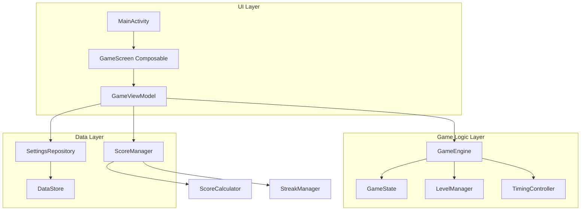
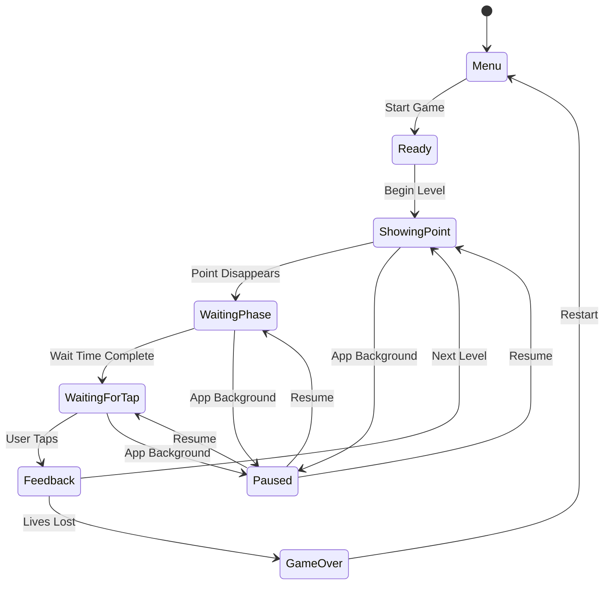

# Punkt - Technische Architektur & Implementierungsplan

## 📋 Projekt-Übersicht

**Projekt**: Punkt (Hyper-Casual Memory-Precision Game)
**Plattform**: Android (API 28+, Target API 36)
**Framework**: Jetpack Compose + Kotlin
**Architektur**: MVVM mit Clean Architecture Prinzipien

## 🏗️ Technologie-Stack

### Core Technologies
- **Kotlin**: 2.0.21
- **Jetpack Compose**: BOM 2024.09.00
- **Material3**: Moderne UI Components
- **Coroutines**: Asynchrone Programmierung und Timing
- **StateFlow/LiveData**: Reactive State Management

### Dependencies (zu ergänzen)
```kotlin
// Game-spezifische Dependencies
implementation("androidx.compose.animation:animation:$compose_version")
implementation("androidx.lifecycle:lifecycle-viewmodel-compose:$lifecycle_version")
implementation("androidx.datastore:datastore-preferences:1.0.0")
implementation("org.jetbrains.kotlinx:kotlinx-coroutines-android:1.7.3")
```

## 🎯 Architektur-Design

### High-Level Architektur



### Komponenten-Struktur

```
app/src/main/java/de/robinrehbein/punkt/
├── ui/
│   ├── screens/
│   │   ├── GameScreen.kt
│   │   ├── MenuScreen.kt
│   │   └── SettingsScreen.kt
│   ├── components/
│   │   ├── GameCanvas.kt
│   │   ├── ScoreDisplay.kt
│   │   └── GameOverDialog.kt
│   └── theme/
├── game/
│   ├── engine/
│   │   ├── GameEngine.kt
│   │   ├── GameState.kt
│   │   └── TimingController.kt
│   ├── logic/
│   │   ├── LevelManager.kt
│   │   ├── HitDetection.kt
│   │   └── DifficultyCalculator.kt
│   └── models/
│       ├── Point.kt
│       ├── GameConfig.kt
│       └── Level.kt
├── scoring/
│   ├── ScoreManager.kt
│   ├── ScoreCalculator.kt
│   └── StreakManager.kt
├── data/
│   ├── repository/
│   │   └── SettingsRepository.kt
│   └── local/
│       └── PreferencesDataStore.kt
└── viewmodels/
    └── GameViewModel.kt
```

## 🎮 Game State Management System

### GameState Enum
```kotlin
sealed class GameState {
    object Menu : GameState()
    object Ready : GameState()
    object ShowingPoint : GameState()
    object WaitingPhase : GameState()
    object WaitingForTap : GameState()
    object Feedback : GameState()
    object GameOver : GameState()
    object Paused : GameState()
}
```

### State Flow Diagramm



## 🎯 Spiellogik-Klassen und Datenmodelle

### Core Data Models

```kotlin
data class Point(
    val x: Float,
    val y: Float,
    val radius: Float,
    val appearanceTime: Long,
    val disappearanceTime: Long
)

data class GameConfig(
    val level: Int,
    val pointSize: Float,
    val showDuration: Long,
    val waitDuration: Long,
    val hitTolerance: Float,
    val gameMode: GameMode = GameMode.CLASSIC
)

enum class GameMode {
    CLASSIC,
    GHOST_POINT,
    MOVING_TARGET,
    VIBRATING_POINT
}

data class HitResult(
    val isHit: Boolean,
    val distance: Float,
    val accuracy: Float, // 0.0 - 1.0
    val points: Int,
    val hitType: HitType
)

enum class HitType {
    PERFECT,    // Zentrum getroffen
    GOOD,       // Nah am Zentrum
    MISS        // Zu weit entfernt
}
```

### GameEngine Klasse

```kotlin
class GameEngine {
    private val _gameState = MutableStateFlow<GameState>(GameState.Menu)
    val gameState: StateFlow<GameState> = _gameState.asStateFlow()
    
    private val _currentPoint = MutableStateFlow<Point?>(null)
    val currentPoint: StateFlow<Point?> = _currentPoint.asStateFlow()
    
    private val timingController = TimingController()
    private val levelManager = LevelManager()
    private val hitDetection = HitDetection()
    
    suspend fun startLevel(config: GameConfig) { /* Implementation */ }
    suspend fun handleTap(x: Float, y: Float): HitResult { /* Implementation */ }
    fun pauseGame() { /* Implementation */ }
    fun resumeGame() { /* Implementation */ }
}
```

## 🎨 UI/UX Architektur mit Jetpack Compose

### GameScreen Composable Struktur

```kotlin
@Composable
fun GameScreen(
    viewModel: GameViewModel = hiltViewModel()
) {
    val gameState by viewModel.gameState.collectAsState()
    val currentPoint by viewModel.currentPoint.collectAsState()
    val score by viewModel.score.collectAsState()
    
    Box(
        modifier = Modifier
            .fillMaxSize()
            .background(Color.Black)
            .pointerInput(Unit) {
                detectTapGestures { offset ->
                    viewModel.handleTap(offset.x, offset.y)
                }
            }
    ) {
        // Game Canvas
        GameCanvas(
            point = currentPoint,
            gameState = gameState,
            modifier = Modifier.fillMaxSize()
        )
        
        // UI Overlay
        GameOverlay(
            score = score,
            level = viewModel.currentLevel.collectAsState().value,
            gameState = gameState
        )
    }
}
```

### Custom Canvas für Punkt-Rendering

```kotlin
@Composable
fun GameCanvas(
    point: Point?,
    gameState: GameState,
    modifier: Modifier = Modifier
) {
    Canvas(modifier = modifier) {
        when (gameState) {
            is GameState.ShowingPoint -> {
                point?.let { p ->
                    drawCircle(
                        color = Color.White,
                        radius = p.radius,
                        center = Offset(p.x, p.y)
                    )
                }
            }
            is GameState.Feedback -> {
                // Feedback-Animation (Treffer-Indikator)
            }
        }
    }
}
```

## ⚡ Performance- und Timing-Anforderungen

### Timing-Präzision
- **Frame Rate**: Konstante 60 FPS
- **Input Latency**: < 16ms (1 Frame)
- **Timing Accuracy**: ±1ms für Spielphasen
- **Memory Usage**: < 50MB RAM

### TimingController Implementation

```kotlin
class TimingController {
    private val scope = CoroutineScope(Dispatchers.Main + SupervisorJob())
    
    suspend fun waitForDuration(duration: Long): Boolean {
        return withContext(Dispatchers.Main) {
            delay(duration)
            true
        }
    }
    
    fun startPrecisionTimer(
        duration: Long,
        onTick: (remaining: Long) -> Unit,
        onComplete: () -> Unit
    ) {
        scope.launch {
            val startTime = System.currentTimeMillis()
            while (System.currentTimeMillis() - startTime < duration) {
                val remaining = duration - (System.currentTimeMillis() - startTime)
                onTick(remaining)
                delay(16) // 60 FPS
            }
            onComplete()
        }
    }
}
```

## 🏆 Scoring- und Progression-System

### Score Calculation Formula

```kotlin
class ScoreCalculator {
    fun calculateScore(hitResult: HitResult, level: Int, streak: Int): Int {
        val baseScore = when (hitResult.hitType) {
            HitType.PERFECT -> 100
            HitType.GOOD -> 50
            HitType.MISS -> 0
        }
        
        val accuracyBonus = (hitResult.accuracy * 50).toInt()
        val levelMultiplier = 1 + (level * 0.1f)
        val streakMultiplier = 1 + (streak * 0.05f)
        
        return ((baseScore + accuracyBonus) * levelMultiplier * streakMultiplier).toInt()
    }
}
```

### Level Progression

```kotlin
data class LevelConfig(
    val level: Int,
    val pointRadius: Float,
    val showDuration: Long,
    val waitDuration: Long,
    val hitTolerance: Float,
    val distractions: List<DistractionType> = emptyList()
)

class LevelManager {
    fun getConfigForLevel(level: Int): LevelConfig {
        return when {
            level <= 10 -> LevelConfig(
                level = level,
                pointRadius = 40f - (level * 2f),
                showDuration = 1000L,
                waitDuration = 2000L,
                hitTolerance = 60f
            )
            level <= 30 -> LevelConfig(
                level = level,
                pointRadius = 20f - ((level - 10) * 1f),
                showDuration = 800L,
                waitDuration = 2000L + ((level - 10) * 200L),
                hitTolerance = 40f - ((level - 10) * 1f)
            )
            else -> LevelConfig(
                level = level,
                pointRadius = 8f,
                showDuration = 500L,
                waitDuration = 7000L,
                hitTolerance = 20f,
                distractions = listOf(DistractionType.VISUAL_NOISE)
            )
        }
    }
}
```

## 🔊 Audio- und Haptic-Feedback-System

### Feedback Events
```kotlin
enum class FeedbackType {
    POINT_APPEAR,
    POINT_DISAPPEAR,
    PERFECT_HIT,
    GOOD_HIT,
    MISS,
    LEVEL_UP,
    GAME_OVER
}

class FeedbackManager(private val context: Context) {
    private val vibrator = context.getSystemService(Context.VIBRATOR_SERVICE) as Vibrator
    
    fun triggerFeedback(type: FeedbackType) {
        when (type) {
            FeedbackType.PERFECT_HIT -> {
                // Kurze, scharfe Vibration
                vibrator.vibrate(VibrationEffect.createOneShot(50, VibrationEffect.DEFAULT_AMPLITUDE))
            }
            FeedbackType.MISS -> {
                // Längere, schwächere Vibration
                vibrator.vibrate(VibrationEffect.createOneShot(200, 100))
            }
        }
    }
}
```

## 💾 Persistierung und Settings-Management

### DataStore Implementation
```kotlin
class SettingsRepository(private val dataStore: DataStore<Preferences>) {
    
    companion object {
        val HIGH_SCORE_KEY = intPreferencesKey("high_score")
        val SOUND_ENABLED_KEY = booleanPreferencesKey("sound_enabled")
        val VIBRATION_ENABLED_KEY = booleanPreferencesKey("vibration_enabled")
        val CURRENT_LEVEL_KEY = intPreferencesKey("current_level")
    }
    
    val highScore: Flow<Int> = dataStore.data.map { preferences ->
        preferences[HIGH_SCORE_KEY] ?: 0
    }
    
    suspend fun saveHighScore(score: Int) {
        dataStore.edit { preferences ->
            preferences[HIGH_SCORE_KEY] = score
        }
    }
}
```

## 🧪 Testing-Strategie

### Test-Kategorien
1. **Unit Tests**: GameEngine, ScoreCalculator, LevelManager
2. **Integration Tests**: ViewModel + Repository Interaktionen
3. **UI Tests**: Compose UI Components
4. **Performance Tests**: Timing-Präzision, Memory Usage

### Beispiel Unit Test
```kotlin
class GameEngineTest {
    @Test
    fun `hit detection calculates correct distance`() {
        val point = Point(100f, 100f, 20f, 0L, 1000L)
        val hitDetection = HitDetection()
        
        val result = hitDetection.checkHit(point, 105f, 105f)
        
        assertEquals(7.07f, result.distance, 0.1f)
        assertEquals(HitType.PERFECT, result.hitType)
    }
}
```

## 📅 Implementierungsreihenfolge und Meilensteine

### Phase 1: Core Foundation (Woche 1-2)
1. Basis-Datenmodelle erstellen
2. GameEngine Grundstruktur
3. Einfache GameScreen UI
4. Basis State Management

### Phase 2: Game Logic (Woche 3-4)
1. TimingController implementieren
2. Hit Detection System
3. Level Progression Logic
4. Score Calculation

### Phase 3: UI/UX Polish (Woche 5-6)
1. Animationen und Transitions
2. Feedback-Systeme
3. Settings Screen
4. Game Over Flow

### Phase 4: Advanced Features (Woche 7-8)
1. Erweiterte Game Modi
2. Ablenkungen und Störer
3. Performance Optimierung
4. Testing und Bug Fixes

### Phase 5: Release Preparation (Woche 9-10)
1. Icon und App Store Assets
2. Finale Tests
3. Performance Profiling
4. Release Build

## 🎯 Nächste Schritte

1. **GameEngine Klasse** als Herzstück implementieren
2. **Basis UI** mit GameScreen aufbauen
3. **Timing System** für präzise Spielphasen
4. **Hit Detection** für Treffer-Berechnung
5. **State Management** zwischen UI und Game Logic

Diese Architektur bietet eine solide Grundlage für die schrittweise Implementierung von "Punkt" mit klaren Verantwortlichkeiten und erweiterbarer Struktur.